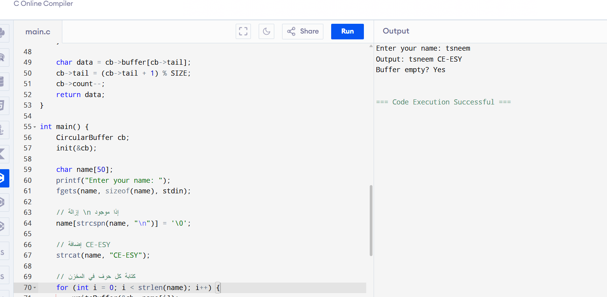

يهدف هذا البرنامج إلى تطبيق مفهوم المخزن الدائري (Circular Buffer) باستخدام لغة C، وهو بنية بيانات تُستخدم لتخزين عناصر بشكل متتابع داخل مصفوفة ثابتة الحجم مع إمكانية الالتفاف عند نهايتها. يعتمد المخزن على ثلاثة مؤشرات أساسية:

head لتحديد موقع الكتابة التالي،

tail لتحديد موقع القراءة التالي،

count لتمثيل عدد العناصر الحالية داخل المخزن.

في بداية التنفيذ، يقوم البرنامج بتهيئة المخزن بحيث يكون فارغًا. بعد ذلك يستقبل البرنامج اسم المستخدم باستخدام دالة fgets لضمان قراءة الاسم كاملًا بما في ذلك الفراغات. ثم يضيف البرنامج السلسلة النصية "CE-ESY" إلى نهاية الاسم المدخل.

بعد تجهيز النص النهائي، يقوم البرنامج بتخزين كل حرف داخل المخزن الدائري. في حال تجاوز عدد الحروف السعة المحددة للمخزن، يتم التعامل مع حالة الامتلاء (Overflow) من خلال طباعة رسالة تنبيه. بعد الانتهاء من عملية الكتابة، يقوم البرنامج بقراءة الحروف من المخزن بنفس ترتيب إدخالها، ويعرضها على الشاشة. وفي النهاية يتحقق البرنامج من أن المخزن أصبح فارغًا بعد عملية القراءة، مما يؤكد صحة عمل آلية التخزين والقراءة.

يمثل هذا البرنامج تطبيقًا عمليًا لمفهوم المخزن الدائري، ويُظهر كيفية التعامل مع حالات الامتلاء والفراغ، إضافةً إلى اختبار سلوك المخزن عند تغيير حجمه.

